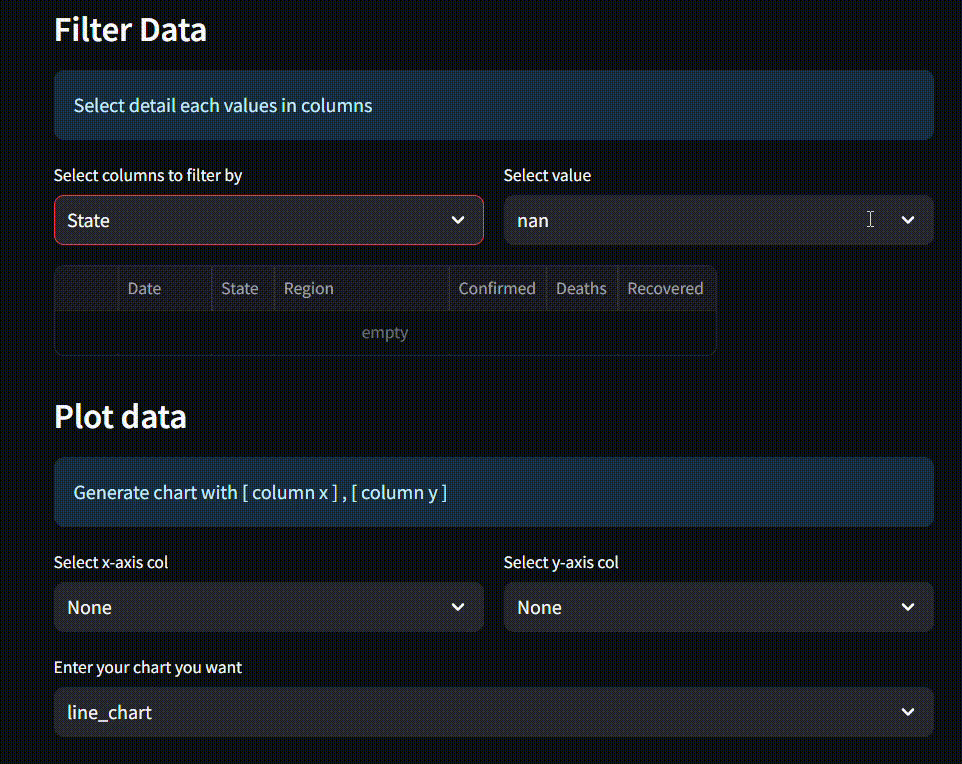
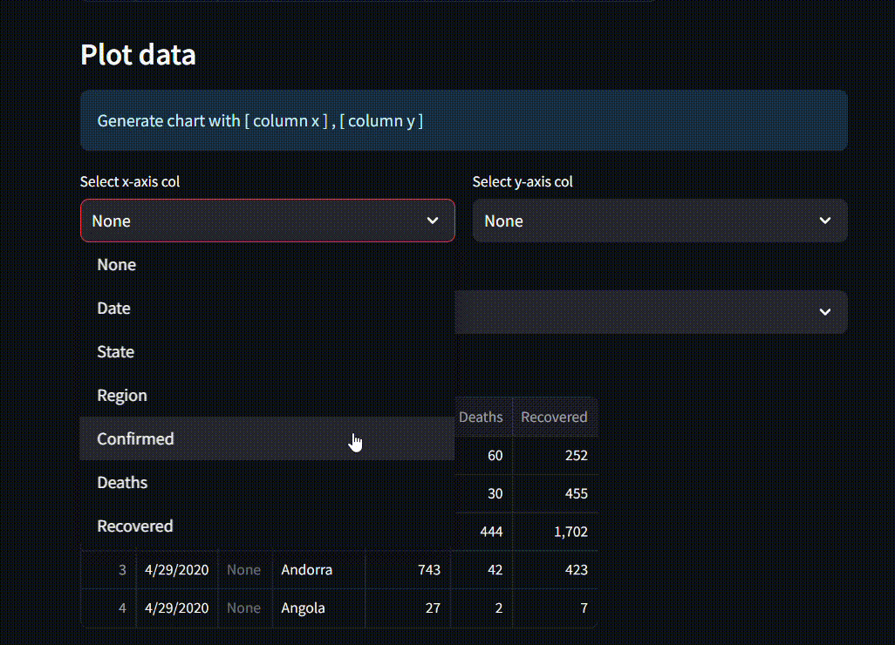
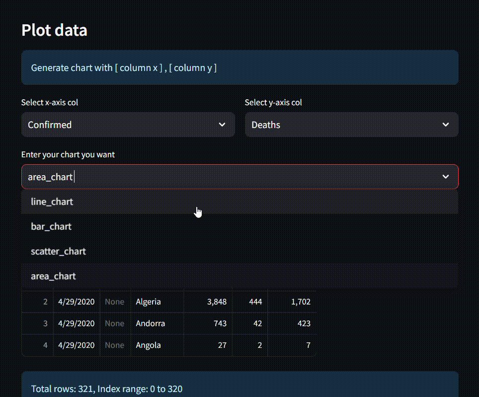
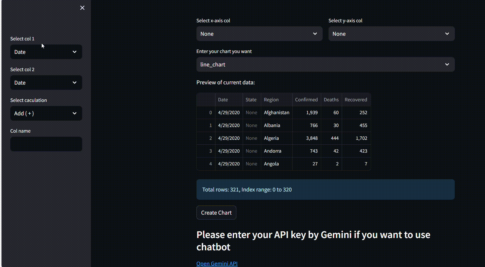

# Dashboard Integration LLM AI

An interactive Streamlit-based dashboard that provides CSV/Excel data visualization, column analysis, and chart creation. The application integrates with the Gemini API for AI-powered data insights, offering analysis recommendations, chart suggestions, and assistance in understanding visualizations.

## Features

### 📂 File Import
- **Supported formats**: CSV,TSV,XLS,XLXS.
- Upload your dataset and instantly view its structure.

### 📊 Column Analysis
- View each column's **unique values** with additional support for rendering images if applicable.



### 🖼️ Chart Creation
- Create dynamic charts with customizable `x` and `y` axes:
  - **Bar Chart**
  - **Line Chart**
  - **Scatter Chart**
  - **Area Chart**

  In case 2 columns:
  
  

  In case with 1 column:
  
  
  

### ➕ Column Calculation
- Create new columns using basic operations: **addition, subtraction, multiplication, division**.
- Changes are dynamically reflected in the dataset.



### 🤖 AI-Powered Insights
- Integrate with **Gemini API** by entering your API key.
- AI provides:
  - Analysis of created charts.
  - Suggestions for new charts.
  - Recommendations for additional columns based on your data.


## Quick Start

1. Clone the repository:
   ```bash
   git clone https://github.com/vy-phan/Data_anylist_tool.git
   cd Data_anylist_tool
   
2. Set up a virtual environment:
   
  -Windows:
   ```bash
    .\venv\Scripts\activate
   ```
  -MacOS/Linux:
   ```bash
    source venv/bin/activate
   ```
3. Install required dependencies:
  ```bash
  pip install -r requirements.txt
  ````

4. Run the application:
   -Windows
     -For Python 3.12 or newer:
     ```bash
     python -m streamlit run main.py
     ```
     -For older Python versions:
     ```bash
     streamlit run main.py
     ```
   -MacOS/Linux:
     ```bash
     streamlit run main.py
     ```
5. Access the application:
   ```bash
    http://localhost:8501

        
